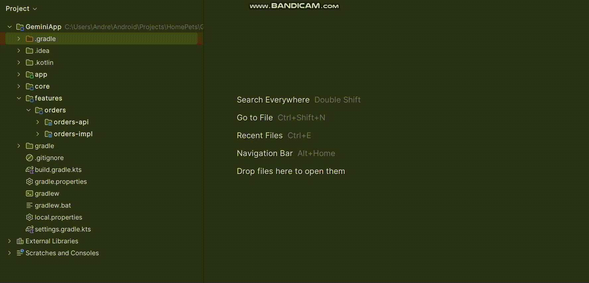

# FeatureModuleCraft Plugin
Plugin for creating feature modules api and impl.

<b>Plugin for IntelliJ based Android Studio.</b>

## Requirements
- Gradle Kotlin DSL
- Hilt with KSP (if use DI files generation)

## Compatibility
- Android Studio versions from (2024.2) to (2024.3)

## Install
- **Installing manually:**
    - Download the plugin package on [GitHub Releases](https://github.com/ArlanchikDrey/FeatureModuleCraft-Plugin/releases).
    - <kbd>Preferences(Settings)</kbd> > <kbd>Plugins</kbd> > <kbd>⚙️</kbd> > <kbd>Install plugin from disk...</kbd> >
      Select the plugin jar and install.

Restart the **IDE** after installation.

## Features
- Creating feature modules api and impl
- Adding layers(domain,data,presentation) to impl module
- Adding Di files to impl module
